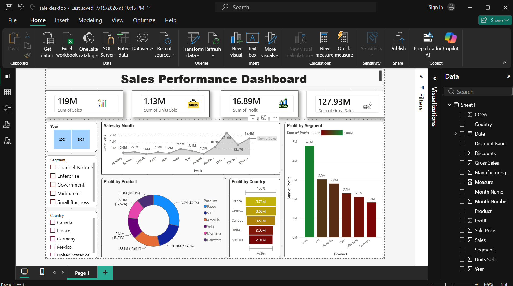

# 📊 Sales Performance Dashboard

## Overview
This project is an interactive Power BI dashboard designed to analyze sales performance across different countries, products, and customer segments. It provides key business insights through KPIs, interactive filters, and visualizations to support data-driven decision-making.

## Dashboard Preview

## Tools & Technologies
- Power BI
- Microsoft Excel
- DAX (Data Analysis Expressions)
- Data Cleaning & Transformation

## Features
- 📈 KPI Cards (Total Sales, Units Sold, Profit, Gross Sales)
- 📅 Monthly Sales Trend Analysis
- 🌍 Profit Analysis by Country
- 📦 Profit Distribution by Product
- 🏢 Profit Analysis by Customer Segment
- 🎛️ Interactive Slicers (Year, Country, Segment)

## Key Insights
- **Total Sales:** 119M
- **Total Profit:** 16.89M
- **Total Units Sold:** 1.13M
- **Gross Sales:** 127.93M

## Repository Contents
- `Dashboard.pbix` – Power BI project file
- `dashboard.png` – Dashboard preview
- `README.md` – Project documentation

## Author
**Ariba Khatoon**
